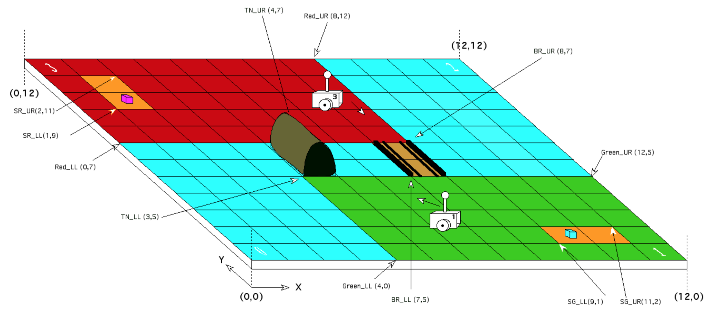

# Design Principles and Methods Team 10 Project

## Project
The goal of this project is to construct an autonomous machine that can play a one-on-one version of the game Capture the Flag. Each of the two players starts in a corner of opposite zones. Each of the zones is surrounded by a virtual river, with two methods of transiting from one zone to another – going under via “tunnel” or over via “bridge”. Each zone corresponds to a rectangular region.

The playing field measures 12’ x 12’, with the origin located in the lower left hand corner. At the start of a round, both players are placed in their respective corners at a random orientation and started. Each player waits for a set of game parameters to be downloaded from the game server. Once the parameters are received (which describe the layout of the laying field), each player must cross the river over to the opponent side. The green zone player always transits using the tunnel and returns via bridge; the red zone player transits over the bridge and returns via tunnel. Both the bridge and tunnel are of fixed width, but variable length. All transits from Green to Red must use the tunnel, and all transits from Red to Green must use the bridge.

Naturally, there are some complications thrown in. In order to smoothly traverse the bridge, the wheelbase must be wide enough so that the wheels fit into the slots. However, this same wheelbase is too wide to fit through the tunnel. The challenge here is to find a vehicle configuration that can navigate both the bridge and the tunnel.

## Team
**Team Manager** Max Musing

**Documentation Manager** Ruptanu Chowdhury

**Testing Lead** Francis Duhamel

**Hardware Lead** Jason Lau

**Software Lead** Yutian Jing

**Hardware Engineer** Ziyin Wei
